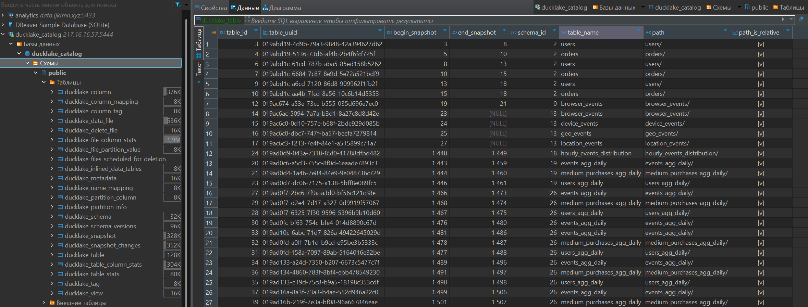

### Почему DuckDB
**DuckDB** — это встраиваемая аналитическая база данных, похожая на SQLite, но заточенная под анализ данных, а не транзакции. Он может работать в памяти `:memory` для быстрых аналитических запросов, с созданием файла для записи данных `data.duckdb`, или в формате **ducklake**.

Преимущества инструмента:
- библиотека, которую можно спокойно запустить в любой программе, а не отдельный сервер;
- хранит данные по столбцам, что кратно ускоряет аналитические запросы;
- использует SQL-движок для общения с данными, вместо pandas и spark api для работы dataframe;
- умеет читать данные из файлов без предварительной загрузки (CSV, JSON, Parquet, pandas.dataframe), а при подключении расширений, данные можно считывать и из других источников, например, из **minio/s3** 
    ```python
    SELECT * FROM read_parquet('s3://mybucket/data/*.parquet')
    ```
- низкий порог входа, что позволяет аналитикам выполнять инженерные задачи.

[Официальная документация DuckDB](https://duckdb.org/install/?platform=windows&environment=cli)

### Что такое DuckLake
**DuckLake** - экспериментальное расширение для **DuckDB**, которое позволяет подключить движок к **minio/s3** storage, **postgresql** метастору, и записывать метаданные в единую БД.

Главное отличие и ключевое преимущество в том, что он для управления всеми метаданными использует стандартную SQL-базу данных (например, PostgreSQL или DuckDB), а не сложные системы файлов, как это делают **Iceberg** или **Delta Lake**.

Метастор хранит информацию о размещении файлов, таблиц, схем, их партиционировании и т.д.:


Особенности инструмента:
- полноценные ACID-транзакции и работа с данными;
- эффективная работа с мелкими изменениями;
- time travel.

[Официальная документация DuckLake](https://ducklake.select/)

### Airflow вместо dbt
**Airflow** отличный инструмент оркестрации для перегрузок данных.

В текущем стеке **ducklake + minio** для построения слоев предпочтительнее использовать **dbt** и инкрементально пересобирать витрины, но из-за избытка новых иструментов (duckdb, streamlit) и команды из 2-х человек, было принято решение не тратить время на изучение **dbt** и для пересборки слоев мы использовали **airflow**.

### Streamlit
**Streamlit**, как и **panel**, является отличным вариантом для визуализации данных из **ducklake**, потому как для подключения к LakeHouse необходимо добавить к подключения код с конфигами **minio**, **postgresql**, и прикрепить их в ducklake, а популярные bi-инструменты как superset и power bi могут работать с **duckdb** только в памяти или из файла `data.duckdb`.

Код для подключения к **ducklake** (переменные окружения передаются в образ):
```python
def env(name, default=None):
    v = os.environ.get(name)
    return v if v not in (None, "") else default

def create_secrets(conn: duckdb.DuckDBPyConnection) -> None:
    conn.execute(f"""
    CREATE OR REPLACE SECRET minio_storage (
        TYPE S3,
        KEY_ID '{env("MINIO_ROOT_USER")}',
        SECRET '{env("MINIO_ROOT_PASSWORD")}',
        ENDPOINT '{env("MINIO_ENDPOINT")}',
        REGION 'eu-central-1',
        USE_SSL false,
        URL_STYLE 'path',
        SCOPE 's3://{env("MINIO_BUCKET")}/'
    );
    """)

    conn.execute(f"""
    CREATE OR REPLACE SECRET pg_meta (
        TYPE POSTGRES,
        HOST '{env("POSTGRES_HOST")}',
        PORT {env("POSTGRES_PORT")},
        DATABASE '{env("POSTGRES_DB")}',
        USER '{env("POSTGRES_USER")}',
        PASSWORD '{env("POSTGRES_PASSWORD")}'
    );
    """)

    conn.execute(f"""
    ATTACH 'ducklake:postgres:' AS lake (
        META_SECRET pg_meta,
        DATA_PATH 's3://{env("MINIO_BUCKET")}/'
    );
    """)
```

[Официальная документация Streamlit](https://streamlit.io/)