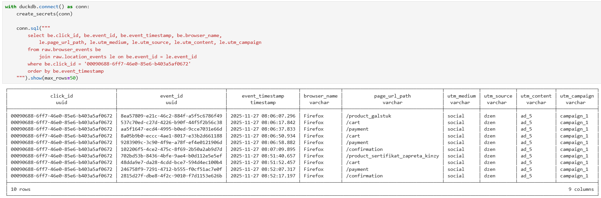
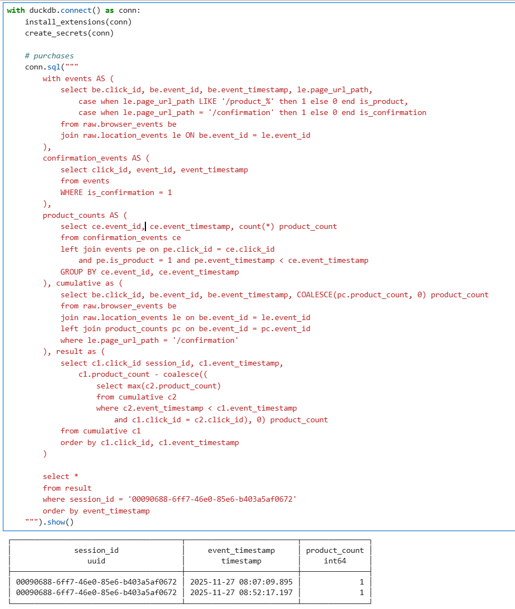
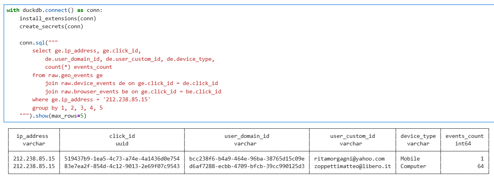

Проект для развертывания стека Lakehouse с использованием современных инструментов обработки данных:
- **duckdb** с расширением **ducklake** - позволяет подключать движок к метастору, в котором указано, как и откуда считывать данные, что позволяет читать их в формате `select * from raw.browser_events`;
- **postgres** - база-метастор для хранения информации по поводу данных, созданных в **minio** при помощи **duckdb** движка;
- **minio** - используется для хранения данных;
- **airflow** - используется для переливки сырых данных и пересборки слоев `raw/stage/mart`
- **streamlit** - 

## Инфраструктура
Структура:
```
├── airflow/          # Оркестрация процессов и ETL-пайплайны
├── minio/            # Object Storage (S3-совместимое хранилище) 
|                     # и postgresql
├── notebook/         # Jupyter Notebook с DuckDB и коннекторами
└── streamlit/        # Веб-интерфейс для визуализации данных
```

Запуск всех инструментов одинаков, но связующим является **minio**: сначала необходимо развернуть его, а потом править `.env` в корне композа и запускать образ:
```bash
cd minio
docker compose up -d
```

### Minio (http://217.16.16.57:9090/)
Образ для развертывания **minio**, который используется для хранения сырых данных (`*.jsonl`) и паркетов, и **postgresql** для хранения метаданных **ducklake**.
Подтягивает переменные окружение из файла `.env`.

> Развернут на отдельной от остальных инструментов ноде


Используется:
- **airflow** для разархивации данных в бакет `ducklake/data/*.jsonl` и дальнейшего построения витрин;
- **notebook** для быстрой аналитики;
- **streamlit** считывает данные из `ducklake/mart/*` через метаданные **ducklake** и строит на этом витрины;

### Notebook
Образ для развертывания **jupyter notebook** со всеми необходимыми библиотеками и переменными окружения для настройки подключения к **minio** и **PostgreSQL**. 

> Необходимо указать параметры для подключения к **minio** и **postgresql** в `.env`-файле


Библиотеки, которые устанавливаются при сборке образа:
```python
jupyterlab>=4,<5 notebook>=7,<8 duckdb==1.4.* duckdb-engine>=0.10 boto3==1.41.0 jupysql>=0.10
```

[Пример кода](notebook/examples/raw.ipynb)

### Airflow (http://217.16.17.159:8082)
Образ для оркестрации переливок данных из **s3** бакета в наш **object storage** и для пересборки витрин.


> Ввиду отсутствия **dbt** в проекте, сборка витрин осуществляется по расписанию через **airflow**

#### Описание процесса.

Каждый час  по расписанию:
 - Параллельная выгрузка из источника и сохранение в **Minio**;
 - Параллельная вставка в `raw`-слой ducklake;
 - Последовательное обновление витрин в `stage/mart` слоях.
Каждый день запускается процесс очистки файлов из **ducklake**.

### Streamlit (http://217.16.17.159:8501/)
Образ для визуализации данных, обращается к **duclake** и вытаскивает данные через **minio** из `mart` слоя, что оказалось более оптимизированным вариантом, нежели использовать ad-hoc анилитику из `raw/stage` слоев:


## Смысл данных
### Покупки
В данных под переходом по ссылке `/product_*` мы понимаем добавление товара в корзину (товары могут дублироваться), и при переходе `/confirmation` происходит оплата, которая привязана к timestamp'у соответстующего ивента.

Из этих данных имеем следующую статистику по покупкам:


### Идентификация клиентов
Во время анализа связи сессий и id-адрессов не было выявлено интересных взаимосвязей, поэтому было решено анализировать данные в разрезе **сессий**:


### Построение слоев:
- [SQL-скрипты для создания слоев](airflow/dags/sql/)
- [DuckDB код для создания витрин](notebook/examples/marts.ipynb)