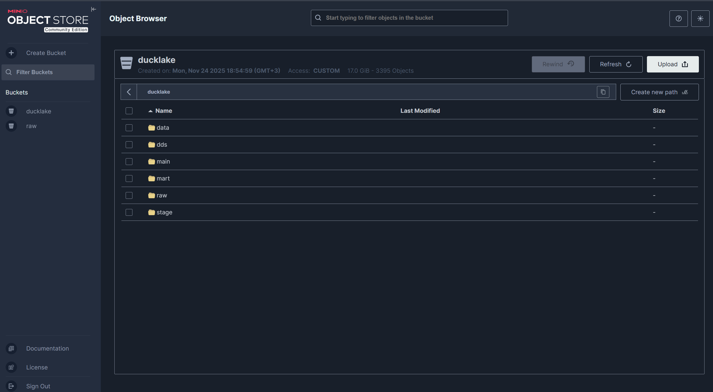
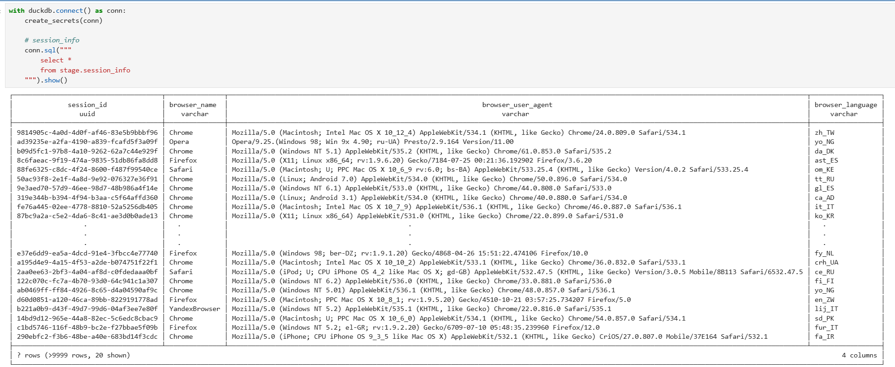
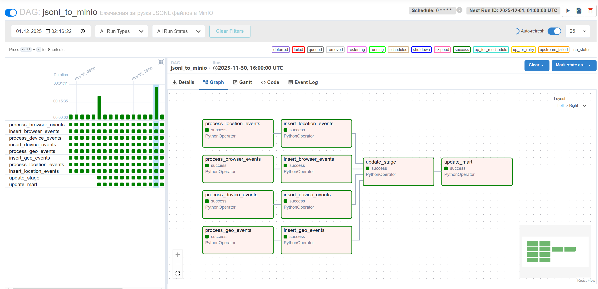
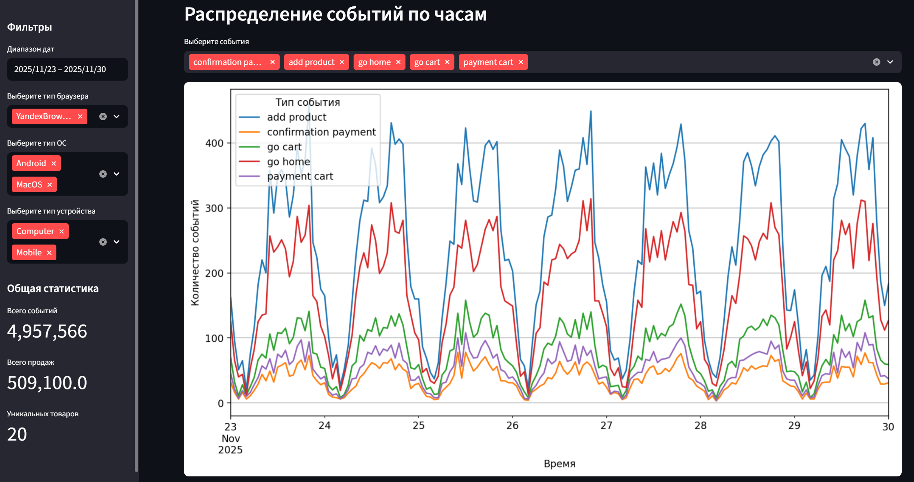

Проект для развертывания стека Lakehouse с использованием современных инструментов обработки данных.

Структура:
```
├── airflow/          # Оркестрация процессов и ETL-пайплайны
├── minio/            # Object Storage (S3-совместимое хранилище) 
|                     # и postgresql
├── notebook/         # Jupyter Notebook с DuckDB и коннекторами
└── streamlit/        # Веб-интерфейс для визуализации данных
```

## [Minio](minio/readme.md) (http://217.16.16.57:9090/)
Образ для развертывания **minio** для хранения данных и **postgresql** для хранения метаданных **ducklake**.
Подтягивает переменные окружение из файла `.env`.

> Развернут на отдельной от остальных инструментов ноде


Используется:
- **airflow** для разархивации данных в бакет `ducklake/data/*.jsonl` и дальнейшего построения витрин;
- **notebook** для быстрой аналитики;
- **streamlit** считывает данные из `ducklake/mart/*` через метаданные **ducklake** и строит на этом витрины;

## [Notebook](notebook/readme.md)
Образ для развертывания **jupyter notebook** со всеми необходимыми библиотеками и переменными окружения для настройки подключения к **minio** и **PostgreSQL**. 

> Необходимо указать параметры для подключения к **minio** и **postgresql** в `.env`-файле



Библиотеки, которые устанавливаются при сборке образа:
```python
jupyterlab>=4,<5 notebook>=7,<8 duckdb==1.4.* duckdb-engine>=0.10 boto3==1.41.0 jupysql>=0.10
```

## Airflow (http://217.16.17.159:8082)
Образ для оркестрации переливок данных из **s3** бакета в наш **object storage** и для пересборки витрин.



> Ввиду отсутствия **dbt** в проекте, сборка витрин осуществляется по расписанию через **airflow**
Описание процесса каждый час:
 - Параллельная выгрузка из источника и сохранение в Minio
 - Параллельная вставка в raw-слой ducklake
 - Последовательное обновление витрин в stage и mart.
Каждый день запускается процесс очистки файлов из ducklake.

Запуск airflow в docker:
```bash
cd airflow
docker compose up
```

## Streamlit (http://217.16.17.159:8501/)
Образ для визуализации данных, обращается к **duclake** и вытаскивает данные через **minio**:


Запуск streamlit в docker:
```bash
cd streamlit
docker compose up
```